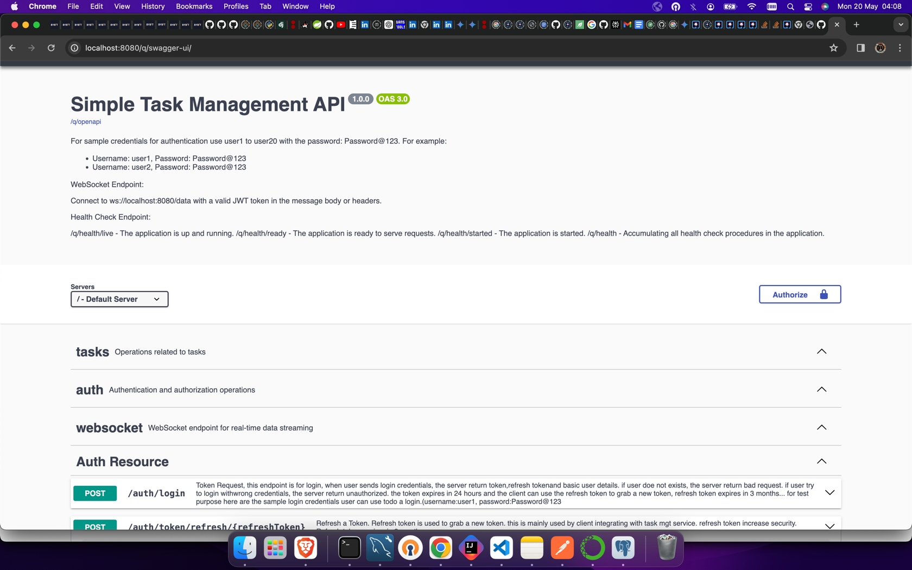
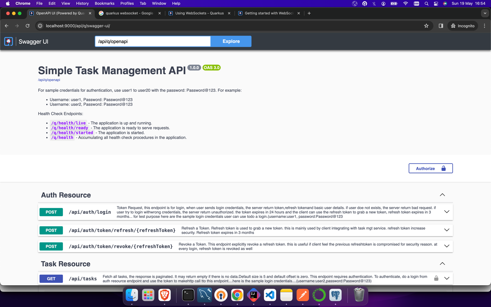
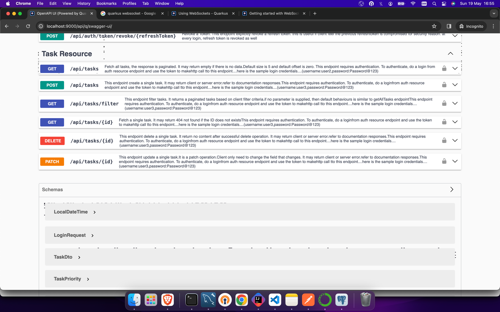
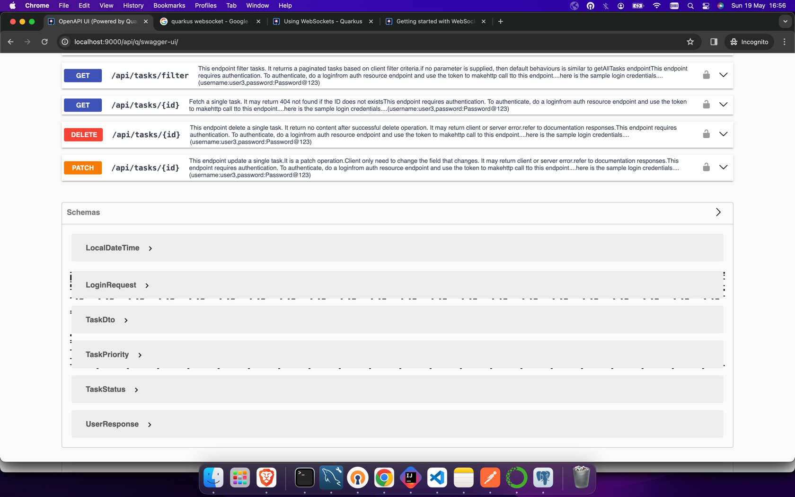

# Simple Task Management API






## Table of Contents
- [Overview](#overview)
- [Technology Stack](#technology-stack)
- [Database](#database)
- [Clone the Repository](#clone-the-repository)
- [Project Setup](#project-setup)
- [Database Migration](#database-migration)
- [Running the Application Locally](#running-the-application-locally)
- [Running Unit Tests](#running-unit-tests)
- [Deployment](#deployment)

## Overview
This project is a simple task management API built with Quarkus, designed to manage tasks with different priorities and statuses. It supports authentication using JWT tokens.

## Technology Stack
- **Java 17**
- - **Java EE**
- **Quarkus**
- **Hibernate ORM with Panache**
- - **PostgreSQL for dev and prod and H2 for unit test**
- **RESTEasy**
- **JWT Authentication**
- **JUnit 5**
- **Flyway** (for database migrations)
- - **Data Streaming** (Websocket)

## Database
This project uses PostgreSQL and H2. Ensure you have PostgreSQL installed and running before setting up the project.

## Clone the Repository
project can be cloned from the link provided
```bash
git clone https://github.com/your-username/your-repo-name.git
cd your-repo-name
````

## Running the application in dev mode


You can run your application in dev mode that enables live coding using.
Ensure you copy  .env.example and create .env file and copy
the content of .env.example and update appropriately.

```shell script

./mvnw compile quarkus:dev

```

## Running the unit test
The test run automatically when you run the application in dev mode as in above.
but if you want to run only test do
```shell script

./mvnw test

```

> **_NOTE:_**  Quarkus now ships with a Dev UI, which is available in dev mode only at http://localhost:8080/q/dev/.


## Packaging and running the application


The application can be packaged using:

```shell script

./mvnw package

```

It produces the `quarkus-run.jar` file in the `target/quarkus-app/` directory.

Be aware that it’s not an _über-jar_ as the dependencies are copied into the `target/quarkus-app/lib/` directory.


The application is now runnable using `java -jar target/quarkus-app/quarkus-run.jar`.


If you want to build an _über-jar_, execute the following command:

```shell script

./mvnw package -Dquarkus.package.jar.type=uber-jar

```


The application, packaged as an _über-jar_, is now runnable using `java -jar target/*-runner.jar`.


## Creating a native executable


You can create a native executable using:

```shell script

./mvnw package -Dnative

```


Or, if you don't have GraalVM installed, you can run the native executable build in a container using:

```shell script

./mvnw package -Dnative -Dquarkus.native.container-build=true

```


You can then execute your native executable with: `./target/task-management-api-1.0.0-SNAPSHOT-runner`


If you want to learn more about building native executables, please consult https://quarkus.io/guides/maven-tooling.

## Data Streaming
go to http://localhost:8080/index.html. this required authentication as well.
to get authentication, do a login by supply sample login credentials.
here is sample login credentials

```shell script
username: user2
password: Password@123

```


